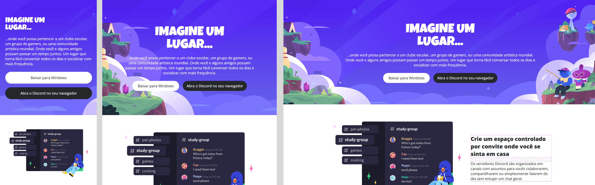

# Bootcamp Santander - Desafios Frontend

Repositório com os projetos desenvolvidos durante o Bootcamp Santander na trilha de **Desenvolvimento Frontend**. Cada desafio está organizado em uma subpasta com seu respectivo conteúdo e histórico de desenvolvimento.

---

## 📁 Projetos

### 🔸 [estrutura-html-basico](estrutura-html-basico/)

📄 **Descrição:**  
O objetivo deste desafio é **elaborar uma página HTML básica**, utilizando uma ampla variedade de tags ensinadas nas aulas e pesquisadas por conta própria.

🎯 **Tags utilizadas:**
- Tags obrigatórias: `<h1>` até `<h6>`, `<p>`, `<mark>`, `<small>`, `<i>`, `<u>`, `<strong>`, `<ol>`, `<ul>`, `<li>`, `<a>`, `<hr>`, `<sub>`, `<sup>`, `<blockquote>`
- Tags pesquisadas: `<font>`, `<del>`, `<abbr>`

🎓 **Foco:**  
Prática com HTML puro e conhecimento da estruturação semântica de conteúdo.

📸 **Prévia do Projeto**


---

### 🔸 [layout-wikipedia](layout-wikipedia/)

📄 **Descrição:**  
Este desafio consiste em **recriar a estrutura de uma página inspirada na Wikipedia**, utilizando semântica e acessibilidade, com um layout mais moderno.  
É uma prática voltada à estruturação de HTML e uso de boas práticas no código.

🎯 **Objetivo:**
- Praticar a estrutura semântica de um site.
- Utilizar tags HTML corretamente.
- Aplicar conceitos de acessibilidade.

📸 **Prévia do Projeto**


---

### 🔸 [landing-page](landing-page/)

📄 **Descrição:**  
Desenvolvimento de uma **Landing Page responsiva**, utilizando HTML e CSS, focando na estrutura, estilização, e boas práticas com unidades relativas e absolutas.

🎯 **Objetivo:**
- Trabalhar com propriedades de layout (`margin`, `padding`, `display`, `position`, etc.).
- Usar unidades de medida como `px`, `rem`, `%`, `em`.
- Praticar organização de código com pastas separadas para estilos e imagens.

📸 **Prévia do Projeto**


---

### 🔸 [clone-pagina-youtube-com-css](clone-pagina-youtube-com-css/)

📄 **Descrição:**  
Neste desafio, o objetivo foi **reproduzir a interface de uma página do YouTube**, utilizando HTML e CSS com foco em Flexbox. O layout base foi fornecido via **Figma**, como exercício de fidelidade visual.

🎯 **Objetivo:**
- Treinar posicionamento com Flexbox.
- Reforçar boas práticas de CSS em layout moderno.
- Reproduzir interfaces reais a partir de um design.

📸 **Prévia do Projeto**


---

### 🔸 [layout-responsivo-site-discord](layout-responsivo-site-discord/)

📄 **Descrição:**  
Desafio prático de reprodução da página principal da plataforma Discord, com foco em responsividade. A interface foi baseada em um layout no Figma, exigindo atenção aos detalhes visuais e adaptação entre diferentes tamanhos de tela.

🎯 **Objetivo:**
- Reforçar conceitos de CSS responsivo.
- Utilizar Flexbox e Media Queries para estrutura fluida.
- Trabalhar com fidelidade visual baseada em um projeto real.

📸 **Prévia do Projeto**


---

### 🔸 [classificador-nivel-heroi](classificador-nivel-heroi)

📄 **Descrição:**  
Neste desafio, o objetivo foi desenvolver um programa em JavaScript que classifica o nível de um herói com base em sua experiência (XP). Aproveitei os aprendizados dos desafios anteriores em HTML e CSS para criar uma interface visual personalizada, prototipada no Figma e aplicada ao projeto.

🎯 **Objetivo:**
- Praticar variáveis, operadores, estruturas de decisão e repetição com JavaScript.
- Consolidar a lógica condicional e exibição de mensagens dinâmicas.

📸 **Prévia do Projeto**


---

## 🚀 Como usar

Clone este repositório e navegue até uma das pastas dos desafios para visualizar ou editar os projetos localmente:

```bash
git clone https://github.com/GabriellySS/bootcamp-santander-frontend.git
cd bootcamp-santander-frontend/layout-wikipedia

